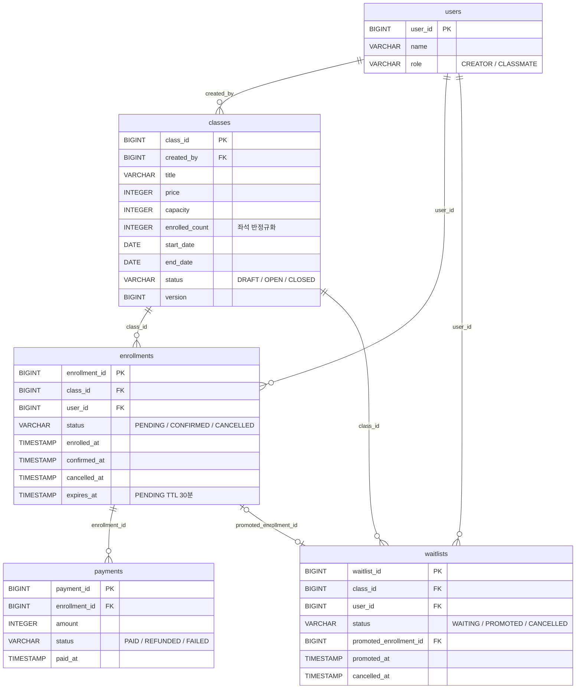

# 수강 신청 시스템

온라인 라이브 클래스의 수강 신청 백엔드 API. 강사가 강의를 개설하고, 수강생이 신청/결제/취소하는 전 과정을 처리한다.

## 프로젝트 개요

- **도메인**: 강사(CREATOR)가 강의를 만들고, 수강생(CLASSMATE)이 신청 → 결제 → 필요 시 취소
- **핵심 과제**: 인기 강의의 동시 신청 경쟁에서 정원 초과 없이 정확히 `capacity`만큼만 수용
- **확장 기능**: 정원이 찬 강의에 대기열 등록, 취소 발생 시 선두 자동 승격
- **결제 UX 보완**: PENDING 상태는 30분 내 결제하지 않으면 자동 취소되어 좌석 복구
- **상태 보존**: 모든 삭제 작업은 상태 전이(CANCELLED/CLOSED)로 대체해 이력 보존

| 도메인 | 상태 머신 |
|--------|----------|
| 강의(Class) | `DRAFT → OPEN → CLOSED` |
| 수강 신청(Enrollment) | `PENDING → CONFIRMED → CANCELLED` (PENDING → CANCELLED 직행 가능) |
| 대기열(Waitlist) | `WAITING → PROMOTED` / `WAITING → CANCELLED` |
| 결제(Payment) | 이력 테이블 (`PAID` / `REFUNDED` / `FAILED` INSERT-only) |

## 기술 스택

| 분류 | 스택 |
|------|------|
| 언어/런타임 | Java 21 |
| 프레임워크 | Spring Boot 3.3.5 (web, data-jpa, validation, actuator) |
| DB | PostgreSQL 15 + Flyway 마이그레이션 |
| 빌드 | Gradle 8.10.2 |
| 문서 | springdoc-openapi 2.6.0 (Swagger UI) |
| 테스트 | JUnit 5, Mockito, Testcontainers(postgres:15-alpine), JaCoCo |
| 인프라 | Docker / Docker Compose |

## 실행 방법

`.env` 파일 없이 바로 기동 가능하다. docker-compose에 기본값이 내장돼 있어 순서대로만 실행하면 된다.

```bash
# 1. 저장소 클론
git clone https://github.com/sensesis/assignment-a.git
cd assignment-a

# 2. PostgreSQL 기동 (백그라운드)
cd enrollment-infra
docker compose up -d

# 3. 앱 실행
cd ../enrollment-api
./gradlew bootRun

# 4. 동작 확인
curl http://localhost:8080/actuator/health
# {"status":"UP",...}
```

### Swagger UI

앱 기동 후 바로 접속 가능. 모든 엔드포인트를 브라우저에서 호출할 수 있다.

```
http://localhost:8080/swagger-ui/index.html
```

### 시드 유저 (리뷰어 수동 테스트용)

Flyway V3가 기동 시 자동으로 시드 유저 2명을 생성한다. 인증 로직을 단순화하기 위해 `X-User-Id` 헤더로 사용자를 식별한다.

| user_id | role | 용도 |
|---------|------|------|
| 1 | CREATOR | 강의 등록/수정/마감 |
| 2 | CLASSMATE | 수강 신청/결제/취소 |

추가 수강생이 필요하면 아래처럼 DB에 직접 INSERT한다.

```sql
INSERT INTO users (name, role, created_at, updated_at)
VALUES ('수강생3', 'CLASSMATE', NOW(), NOW());
```

### 환경 변수 (커스텀 시)

docker-compose와 Spring 모두 아래 변수를 참조한다. 기본값으로 충분하지만 포트 충돌 시 `enrollment-infra/.env`를 만들어 덮어쓴다.

| 변수 | 기본값 | 용도 |
|------|--------|------|
| `POSTGRES_DB` | liveklass | DB 이름 |
| `POSTGRES_USER` | liveklass | DB 사용자 |
| `POSTGRES_PASSWORD` | liveklass | DB 비밀번호 |
| `POSTGRES_PORT` | 5432 | 호스트 포트 바인딩 |
| `SPRING_DATASOURCE_URL` | `jdbc:postgresql://localhost:5432/liveklass` | 앱이 바라보는 JDBC URL |

## API 목록 및 예시

전체 14개 엔드포인트. 권한 컬럼의 "본인"은 리소스 소유자 검증, "CREATOR"는 역할 검증을 의미한다.

### 강의 (`/classes`)

| 메서드 | 경로 | 권한 | 설명 |
|--------|------|------|------|
| POST | `/classes` | CREATOR | 강의 등록 (DRAFT 생성) |
| PATCH | `/classes/{id}` | 본인 강사 | 강의 수정 (DRAFT만 가능) |
| PATCH | `/classes/{id}/publish` | 본인 강사 | DRAFT → OPEN |
| PATCH | `/classes/{id}/close` | 본인 강사 | OPEN → CLOSED |
| GET | `/classes?status=OPEN&page=0&size=20` | 누구나 | 강의 목록 조회 |
| GET | `/classes/{id}` | 누구나 | 강의 상세 조회 |
| GET | `/classes/me` | 강사 | 내가 개설한 강의 목록 |
| GET | `/classes/{id}/enrollments` | 본인 강사 | 강의별 수강생 목록 |

### 수강 신청 (`/enrollments`)

| 메서드 | 경로 | 권한 | 설명 |
|--------|------|------|------|
| POST | `/enrollments` | 수강생 | 신청 (PENDING 생성 + 좌석 즉시 차감) |
| PATCH | `/enrollments/{id}/pay` | 본인 | PENDING → CONFIRMED + PAID 결제 기록 |
| PATCH | `/enrollments/{id}/cancel` | 본인 | CANCELLED 전이 + 좌석 복구 + 환불 이력 |
| GET | `/enrollments/me` | 수강생 | 내 수강 신청 목록 |

### 대기열 (`/classes/{id}/waitlist`)

| 메서드 | 경로 | 권한 | 설명 |
|--------|------|------|------|
| POST | `/classes/{id}/waitlist` | 수강생 | 정원 차면 대기열 등록 |
| DELETE | `/classes/{id}/waitlist/me` | 본인 | 본인 대기열 철회 |

### 요청 흐름 예시

```bash
# 강의 등록 (CREATOR)
curl -X POST http://localhost:8080/classes \
  -H "X-User-Id: 1" -H "Content-Type: application/json" \
  -d '{
    "title": "Java 기초",
    "description": "자바 입문 강의",
    "price": 50000,
    "capacity": 10,
    "startDate": "2026-06-01",
    "endDate": "2026-06-30"
  }'

# 강의 공개
curl -X PATCH http://localhost:8080/classes/1/publish -H "X-User-Id: 1"

# 수강 신청
curl -X POST http://localhost:8080/enrollments \
  -H "X-User-Id: 2" -H "Content-Type: application/json" \
  -d '{"classId": 1}'

# 결제 (30분 이내)
curl -X PATCH http://localhost:8080/enrollments/1/pay -H "X-User-Id: 2"

# 취소 (결제 후 7일 이내)
curl -X PATCH http://localhost:8080/enrollments/1/cancel -H "X-User-Id: 2"

# 정원 초과 시 대기열 등록
curl -X POST http://localhost:8080/classes/1/waitlist -H "X-User-Id: 3"
```

### 에러 응답 포맷

모든 에러는 동일 포맷으로 내려온다.

```json
{
  "code": "CAPACITY_EXCEEDED",
  "message": "정원이 초과되었습니다",
  "timestamp": "2026-04-19T14:00:00",
  "path": "/enrollments"
}
```

에러 코드 카탈로그는 21종이며 전부 `global/error/exception/ErrorCode.java`에 enum으로 정의돼 있다. 주요 코드만 추리면:

| code | HTTP | 발생 시점 |
|------|------|----------|
| `CAPACITY_EXCEEDED` | 400 | 정원 초과 신청 |
| `HOLD_EXPIRED` | 400 | PENDING 30분 초과 후 결제 시도 |
| `CANCEL_PERIOD_EXPIRED` | 400 | 결제 후 7일 초과 취소 시도 |
| `INVALID_STATE_TRANSITION` | 400 | 허용 안 된 상태 전이 |
| `WAITLIST_NOT_ALLOWED` | 400 | 정원 여유 있는 강의에 대기열 시도 등 |
| `NOT_COURSE_OWNER` | 403 | 남의 강의 수정 시도 |
| `NOT_ENROLLMENT_OWNER` | 403 | 남의 수강 신청 조작 시도 |
| `FORBIDDEN_ROLE` | 403 | CLASSMATE의 강의 등록 시도 |
| `ALREADY_ENROLLED` | 409 | 활성 수강 신청 있는 상태에서 재신청 |
| `ALREADY_IN_WAITLIST` | 409 | 이미 대기 중인데 재등록 |

## 데이터 모델 설명

### ERD



### 핵심 제약

| 테이블 | 제약/인덱스 | 목적 |
|--------|-----------|------|
| classes | `CHECK (0 <= enrolled_count <= capacity)` | 좌석 불변식 DB 레벨 방어 |
| classes | `CHECK (end_date > start_date)` | 기간 유효성 |
| enrollments | `uk_active_enrollment(class_id, user_id) WHERE status IN ('PENDING','CONFIRMED')` | 중복 활성 신청 차단 (취소 후 재신청은 허용) |
| enrollments | `idx_enrollments_pending_expires(expires_at) WHERE status='PENDING'` | TTL 만료 스캔 최적화 |
| payments | `uk_payment_paid(enrollment_id) WHERE status='PAID'` | 이중 결제 DB 레벨 차단 |
| waitlists | `uk_active_waitlist(class_id, user_id) WHERE status='WAITING'` | 중복 대기 차단 |
| waitlists | `idx_waitlist_fifo(class_id, created_at, waitlist_id) WHERE status='WAITING'` | 선두 조회 시 일관된 순번 보장 |

양방향 JPA 매핑은 전부 제거했다. 역참조가 필요하면 Repository 쿼리로 명시적으로 조회한다(JSON 순환 참조 + N+1 회피).

## 요구사항 해석 및 가정

| # | 해석 |
|---|------|
| 1 | 인증은 `X-User-Id` 헤더로 단순화. 실서비스에서는 게이트웨이가 JWT를 해석해 주입하는 구조를 가정 |
| 2 | 좌석 차감은 신청(PENDING 생성) 시점. 결제 완료 후 좌석 없음 상황을 원천 차단 |
| 3 | 결제는 PG 연동 없이 호출 즉시 `PAID` 기록. 실제 환경에서는 PG 콜백 + `pg_transaction_id` 컬럼이 추가될 자리 |
| 4 | 취소 가능 기간은 CONFIRMED 이후 7일. 강의별 정책은 추후 `classes` 컬럼으로 이동 가능 |
| 5 | 한 User가 CREATOR와 CLASSMATE 역할을 동시에 수행할 수 있음. `role`은 힌트, 실제 권한은 리소스 소유권(FK)으로 판단 |
| 6 | 강사 본인이 자기 강의를 수강하는 건 허용 (요구사항에 금지 조항 없음) |
| 7 | 수강 취소 후 동일 강의 재신청 허용. 중복 방지 유니크 인덱스를 활성 상태(`PENDING`/`CONFIRMED`)로만 제한 |
| 8 | CONFIRMED 취소 시 `payments`에 `REFUNDED` 행을 추가. 금전 환불은 PG 영역이라 이력만 기록 |
| 9 | PENDING 결제 지연 시 좌석 영구 홀드 문제는 TTL 30분 + 1분 주기 스케줄러로 해소. 만료 즉시 대기열 선두 자동 승격 |

## 설계 결정과 이유

### 1. 좌석 차감은 신청 시점 (결제 시점 X)

결제 시점에 좌석을 잡으면 "여러 PENDING이 동시에 결제 완료하면 한 명만 성공, 나머지는 환불" 시나리오가 발생한다. 신청 시점에 좌석을 홀드하면 동시성 제어 지점이 신청 API 하나로 좁혀진다.

### 2. 동시성 제어는 비관적 락 (`SELECT ... FOR UPDATE`)

인기 강의는 충돌 빈도가 높아 낙관적 락(`@Version` 재시도)은 비용이 크다. `ClassRepository.findByIdForUpdate()`로 `classes` 행 하나를 직렬화하고, 그 락 안에서 `enrolled_count`를 증가시킨다. 신청/취소/대기열 승격 모두 동일 방식으로 처리한다.

검증: `EnrollmentConcurrencyTest`(정원 1에 10명 동시 신청 → 1명만 성공), `WaitlistConcurrencyTest`(2건 동시 취소 → 2명 승격 + 좌석 증감 합계 0).

### 3. 좌석 수 반정규화 (`classes.enrolled_count`)

**정규형 기준**: 현재 좌석 수는 `SELECT COUNT(*) FROM enrollments WHERE class_id=? AND status IN ('PENDING','CONFIRMED')`로 언제든 파생 가능하다. 별도 컬럼을 두는 건 3NF 위반인 반정규화 선택.

**그럼에도 컬럼으로 뺀 이유**
- 강의 목록 조회(`GET /classes`)는 가장 빈번한 읽기 경로. 페이지당 강의 20건마다 집계 서브쿼리가 붙으면 응답 비용이 `|classes| × |enrollments|`에 비례
- 신청 API의 정원 여부 판단(`hasVacancy()`)은 뜨거운 경로 — 요청마다 집계를 돌릴 수 없음
- 반대로 enrollments INSERT/UPDATE는 신청/결제/취소/승격 시점에만 발생하므로 쓰기 비용은 제한적

**정합성 방어 3중 구조** (반정규화가 만드는 부채를 상쇄)
1. 서비스 레이어: `classEntity.hasVacancy()` 사전 체크
2. 도메인 메서드: `incrementEnrolled()` / `decrementEnrolled()` 범위 검사 후 상태 변경
3. DB `CHECK (0 <= enrolled_count <= capacity)`: 애플리케이션 버그가 뚫어도 DB가 거부

### 4. 중복 신청 방지는 부분 유니크 인덱스

```sql
CREATE UNIQUE INDEX uk_active_enrollment
    ON enrollments(class_id, user_id)
    WHERE status IN ('PENDING', 'CONFIRMED');
```

CANCELLED 행은 인덱스 바깥이라 취소 후 재신청이 자연스럽게 허용된다. MySQL이라면 Generated Column 우회가 필요했을 것 — PostgreSQL 선택으로 스키마가 단순해졌다.

### 5. 결제는 이력 테이블 (INSERT-only)

`payments.status`는 전이 없이 새 행 삽입으로만 바뀐다. 결제 성공 `PAID`, 환불 시 `REFUNDED`, 실패 시 `FAILED` 모두 별도 행. `uk_payment_paid WHERE status='PAID'`로 이중 결제가 DB 레벨에서 막힌다. 감사/환불 추적이 간단해진다.

### 6. 대기열 — 수동 등록 + 자동 승격

정원 초과 응답(`CAPACITY_EXCEEDED`)을 받은 클라이언트가 명시적으로 `POST /classes/{id}/waitlist`를 호출한다(자동 대기 없음). 수강 취소가 일어나면 `EnrollmentService.cancel()`이 동일 트랜잭션 내에서 `WaitlistService.promoteNext()`를 호출해 선두를 자동 승격시킨다.

승격 직전에 해당 사용자가 이미 다른 경로로 활성 신청을 가지고 있으면 건너뛰고 다음 선두로 이동한다(while 루프). 승격된 대기자는 PENDING으로 생성되고 결제만 하면 확정된다.

### 7. PENDING TTL — 30분 후 자동 취소 + 연쇄 승격

결제 지연으로 좌석이 무한 홀드되는 문제를 막기 위해 PENDING에 `expires_at`을 세팅한다(기본 30분). `EnrollmentExpirationScheduler`가 1분 주기로 만료된 건을 스캔해 100건씩 배치 처리:

1. 독립 트랜잭션(`TransactionTemplate`)으로 건별 처리 → 한 건 실패가 배치 전체를 막지 않음
2. 만료 → CANCELLED 전이 → `enrolled_count` 감소 → `promoteNext()` 호출 → 다음 대기자 승격
3. 결제 경로(`pay()`)는 스케줄러와 같은 행을 건드리므로 `findByIdForUpdate()`로 직렬화해 경쟁 조건 차단

배치 100 × 1분 = 시간당 6,000건 처리 용량. 이 이상 필요하면 `BATCH_SIZE` 조정 또는 다중 tick drain 방식으로 확장.

### 8. 역할 검증은 강의 등록에만

`POST /classes`만 CREATOR 역할을 요구한다(`FORBIDDEN_ROLE`). 강의 수정/공개/마감/수강생 목록 조회는 "본인 강의" 소유권 검증으로 충분하다. 한 User가 CREATOR와 CLASSMATE 역할을 동시에 가질 수 있다는 가정과 일관된다.

## 테스트 실행 방법

```bash
cd enrollment-api

# 전체 테스트 (Testcontainers가 Postgres 15-alpine을 자동 기동)
./gradlew test

# 커버리지 리포트 (JaCoCo)
./gradlew test jacocoTestReport
open build/reports/jacoco/test/html/index.html
```

### 구성 요약 (전체 226 tests)

| 계층 | 도구 | 주요 대상 |
|------|------|----------|
| 엔티티 단위 | JUnit 5 | 상태 머신 전이, 도메인 메서드 불변식 |
| Service 단위 | Mockito | 비즈니스 분기, 예외 경로 |
| Repository 통합 | `@DataJpaTest` + Testcontainers | CHECK 제약 / 부분 유니크 인덱스 / JOIN FETCH |
| Controller 슬라이스 | `@WebMvcTest` + `@Import(GlobalExceptionHandler)` | HTTP 상태 / 에러 코드 매핑 |
| 동시성 통합 | `@SpringBootTest` + Testcontainers | 10개 스레드 정원 경쟁, 좌석 증감 합계 0 |
| 스케줄러 통합 | `@SpringBootTest` + Awaitility | TTL 만료 + 연쇄 승격 |

Testcontainers가 실제 PostgreSQL 15를 띄워 Flyway 마이그레이션 V1~V7까지 전부 실행한다. ddl-auto는 `validate`라 엔티티와 스키마 불일치가 있으면 기동 자체가 실패한다.

## 미구현 / 제약사항

과제 요구(강의 CRUD, 수강 신청, 결제, 취소, 대기열, 동시성, PENDING TTL)는 모두 구현돼 있다. 아래는 **MVP 범위에서 의도적으로 제외**한 항목이며 각 항목마다 제외 근거와 확장 방식을 적었다.

### 외부 연동

| 항목 | 현재 상태 | 제외 근거 | 확장 방식 |
|------|---------|----------|---------|
| 실제 PG 연동 | 결제 API 호출 즉시 `PAID` 기록 (시뮬레이션) | PG 계약/콜백 처리는 실서비스 컨텍스트가 있어야 의미 있음. 과제의 핵심은 "결제 → 좌석 확정" 상태 전이 로직 | 중간 상태 `PENDING_APPROVAL` 추가 + PG 콜백 컨트롤러 + `pg_transaction_id` 컬럼 |
| 인증/인가 | `X-User-Id` 헤더 신뢰 | 요구사항에 인증 명시 없음. Spring Security/JWT 도입 시 범위가 커져 비즈니스 로직 검증 공간 축소 | API Gateway에서 JWT 검증 후 `X-User-Id` 주입 (현재 컨트롤러 코드는 그대로 재사용) |

### 알림/사용자 편의

| 항목 | 현재 상태 | 제외 근거 | 확장 방식 |
|------|---------|----------|---------|
| 이메일/푸시 승격 알림 | `[Waitlist] Promoted user=...` INFO 로그 기록. 승격자는 `/enrollments/me`에서 PENDING 확인 | 알림 채널(SMTP/FCM/APNS)은 별도 인프라 계약 필요. 로그로 트레이스는 확보 | `WaitlistService.promoteNext()`에서 도메인 이벤트 발행 → 별도 알림 서비스 구독 |
| 대기 순번 조회 API | 미구현 | 요구사항에 "본인이 몇 번째" 조회 명시 없음. 등록 성공 응답만으로 대기 사실은 전달 | `ROW_NUMBER() OVER (PARTITION BY class_id ORDER BY created_at)` 기반 별도 엔드포인트 |

### 운영 확장

| 항목 | 현재 상태 | 제외 근거 | 확장 방식 |
|------|---------|----------|---------|
| 강의 기간 종료 자동 마감 | `end_date` 경과해도 OPEN 유지. 강사가 수동 `/close` 호출 | 요구사항에 자동 마감 언급 없음. 기간 지난 강의도 정원 체크/상태 검증이 이미 작동하므로 기능 차이 없음 | `@Scheduled` 자정 배치로 `end_date < now AND status='OPEN'` 대상 CLOSED 전이 |
| 다중 인스턴스 분산 락 | 단일 인스턴스 기준 Postgres 행 락(`SELECT FOR UPDATE`) | 수평 확장은 과제 범위 밖. 단일 인스턴스에서는 DB 행 락으로 일관성 완벽 보장 | 락 대상이 `classes` 행 하나라 Redis 분산락(Redisson) 도입이 단순 |
| 결제 `FAILED` 상태 | enum만 정의, 실사용 경로 없음 | 시뮬레이션 결제라 실패 시나리오가 발생하지 않음 | PG 연동 시 콜백에서 `FAILED` INSERT + `enrollment.expire()` 또는 재시도 유도 |

## AI 활용 범위

도구: Claude Code (Opus 4.7 / Sonnet 4.6).

**기획과 요구사항 해석은 직접 수행**했다. 어떤 테이블을 둘지, 어느 시점에 좌석을 잡을지, TTL을 몇 분으로 둘지 같은 설계 결정은 본인이 정했다. AI는 아래 보조 역할로 활용했다.

| 단계 | 활용 방식 |
|------|----------|
| 구현 검증 | 구현 후 Critic 에이전트로 3회 반복 리뷰(계획 3회 + 구현 3회). 시니어 관점의 코드 스멜/논리 허점 지적을 받아 수정 |
| 테스트 시나리오 발굴 | 경계값(7일 정확, 29:59분, 30:01분), 10스레드 경쟁, 부분 유니크 인덱스 양방향 등 케이스 후보 제안 받고 본인이 선별 |
| 커밋 메시지 / PR 본문 / README | 초안 생성 후 직접 문체 다듬고 내용 재검증 |
| 제외 | 비즈니스 요구사항 해석, 설계 방향 결정, 최종 병합 승인은 AI 출력을 그대로 사용하지 않음 |

주요 프롬프트 패턴은 "X 대신 Y로 바꾸면 어떤 trade-off가 있나?" / "이 코드에서 실무에서 지적될 수 있는 부분은?" 같은 비판·검토형 질문. AI 출력은 전부 프로젝트 컨벤션에 맞게 수동 재작성했다.
