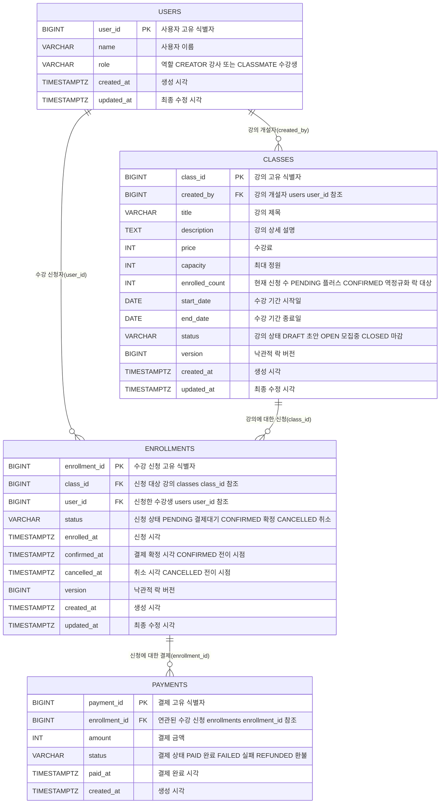

# 수강 신청 시스템 — 기획서

## 프로젝트 개요

온라인 강의 플랫폼의 수강 신청 시스템 백엔드 API. 크리에이터(강사)가 강의를 개설하고, 클래스메이트(수강생)가 신청·결제·취소하는 전 과정을 처리한다.

**핵심 비즈니스 규칙**
- 강의는 `DRAFT → OPEN → CLOSED` 상태로 전이한다
- 수강 신청은 `PENDING → CONFIRMED → CANCELLED` 상태로 전이한다
- 정원 초과 시 신청을 거부한다
- 결제가 완료되어야 수강이 확정된다
- 수강 확정 후 7일 이내에만 취소 가능하다
- 동시에 여러 사용자가 마지막 자리를 신청해도 정원은 정확히 지켜진다

**과제 핵심 난이도**
- **동시성 제어** — 다수의 수강생이 마지막 자리를 동시에 신청할 때 정원 초과를 막는 락 전략
- **상태 머신** — 강의·수강 신청·결제 세 도메인이 각자의 상태 규칙을 가지며 서로 맞물려 동작
- **좌석 홀드** — 신청 시점에 좌석을 차감하고 결제까지 유지하는 "예약" 개념

---

## 기술 스택

| 분류 | 기술 | 비고 |
|------|------|------|
| 언어 | Java 21 |  |
| 프레임워크 | Spring Boot 3.3 |  |
| ORM | Spring Data JPA (Hibernate) | 도메인 중심 매핑 |
| DB | PostgreSQL 15+ | 부분 인덱스(partial index), `TIMESTAMPTZ` 활용 |
| 마이그레이션 | Flyway | 버전별 DDL 관리 |
| 빌드 | Gradle |  |
| 문서 | Swagger (springdoc-openapi) |  |
| 테스트 | JUnit 5, Mockito, Spring Boot Test |  |
| 유틸 | Lombok |  |

**동시성 전략**: PostgreSQL의 비관적 락 (`SELECT ... FOR UPDATE`)
**인증**: 과제 요구사항에 따라 생략. `X-User-Id` 헤더로 사용자 식별

---

## 실행 방법

> _(추후 작성)_

---

## API 목록 및 예시

### 공통 에러 응답 포맷

모든 API는 에러 발생 시 아래 포맷으로 응답한다.

```json
{
  "code": "CAPACITY_EXCEEDED",
  "message": "정원이 초과되었습니다",
  "timestamp": "2026-04-15T10:00:00",
  "path": "/enrollments"
}
```

**HTTP 상태코드 매핑**

| 상황 | 상태코드 | code 예시 |
|------|--------|---------|
| 정상 조회 | 200 OK | — |
| 정상 생성 | 201 Created | — |
| 입력값 오류 | 400 Bad Request | `INVALID_INPUT` |
| 비즈니스 규칙 위반 | 400 Bad Request | `CAPACITY_EXCEEDED`, `CANCEL_PERIOD_EXPIRED`, `ALREADY_CANCELLED` |
| 상태 전이 불가 | 400 Bad Request | `INVALID_STATE_TRANSITION` |
| 인증 없음 | 401 Unauthorized | `UNAUTHORIZED` |
| 권한 없음 | 403 Forbidden | `FORBIDDEN`, `NOT_COURSE_OWNER` |
| 리소스 없음 | 404 Not Found | `USER_NOT_FOUND`, `CLASS_NOT_FOUND`, `ENROLLMENT_NOT_FOUND` |
| 중복 신청 | 409 Conflict | `ALREADY_ENROLLED` |
| 락 획득 실패 | 423 Locked / 503 | `LOCK_TIMEOUT` |
| 서버 오류 | 500 Internal Server Error | `INTERNAL_ERROR` |

### 전체 엔드포인트

| # | Method | Path | 설명 | 권한 |
|---|--------|------|------|------|
| 1 | POST | `/classes` | 강의 등록 (DRAFT 상태로 생성) | 강사 |
| 2 | PATCH | `/classes/{id}` | 강의 정보 수정 (DRAFT에서만) | 본인 강사 |
| 3 | PATCH | `/classes/{id}/publish` | 강의 공개 (DRAFT → OPEN) | 본인 강사 |
| 4 | PATCH | `/classes/{id}/close` | 모집 마감 (OPEN → CLOSED) | 본인 강사 |
| 5 | GET | `/classes?status=OPEN&page=0&size=20` | 강의 목록 조회 | 누구나 |
| 6 | GET | `/classes/{id}` | 강의 상세 조회 | 누구나 |
| 7 | GET | `/classes/me?page=0&size=20` | 내가 개설한 강의 목록 | 강사 |
| 8 | GET | `/classes/{id}/enrollments?page=0&size=20` | 특정 강의 수강생 목록 | 본인 강사 |
| 9 | POST | `/enrollments` | 수강 신청 (PENDING 생성 + 좌석 차감) | 수강생 |
| 10 | PATCH | `/enrollments/{id}/pay` | 결제 확정 (PENDING → CONFIRMED) | 본인 수강생 |
| 11 | PATCH | `/enrollments/{id}/cancel` | 수강 취소 (→ CANCELLED + 좌석 복구) | 본인 수강생 |
| 12 | GET | `/enrollments/me?page=0&size=20` | 내 수강 신청 목록 | 수강생 |

### 1. 강의 등록 — `POST /classes`

**요청**
```http
POST /classes
X-User-Id: 1
Content-Type: application/json

{
  "title": "스프링 부트 입문",
  "description": "스프링 부트 3.3을 다룬다",
  "price": 50000,
  "capacity": 10,
  "startDate": "2026-05-01",
  "endDate": "2026-05-31"
}
```

**응답**
```http
HTTP/1.1 201 Created

{
  "classId": 100,
  "status": "DRAFT",
  "title": "스프링 부트 입문",
  "capacity": 10,
  "enrolledCount": 0,
  "createdAt": "2026-04-15T10:00:00"
}
```

### 2. 강의 공개 — `PATCH /classes/{id}/publish`

**요청**
```http
PATCH /classes/100/publish
X-User-Id: 1
```

**응답**
```http
HTTP/1.1 200 OK

{
  "classId": 100,
  "status": "OPEN"
}
```

### 3. 강의 목록 조회 — `GET /classes`

**요청**
```http
GET /classes?status=OPEN&page=0&size=20
```

**응답**
```http
HTTP/1.1 200 OK

{
  "content": [
    {
      "classId": 100,
      "title": "스프링 부트 입문",
      "price": 50000,
      "capacity": 10,
      "enrolledCount": 7,
      "startDate": "2026-05-01",
      "endDate": "2026-05-31",
      "status": "OPEN",
      "creatorName": "홍길동"
    }
  ],
  "totalElements": 45,
  "totalPages": 3,
  "number": 0,
  "size": 20
}
```

### 4. 수강 신청 — `POST /enrollments`

**요청**
```http
POST /enrollments
X-User-Id: 42
Content-Type: application/json

{
  "classId": 100
}
```

**응답 (성공)**
```http
HTTP/1.1 201 Created

{
  "enrollmentId": 500,
  "classId": 100,
  "status": "PENDING",
  "enrolledAt": "2026-04-15T11:00:00"
}
```

**응답 (정원 초과)**
```http
HTTP/1.1 400 Bad Request

{
  "code": "CAPACITY_EXCEEDED",
  "message": "정원이 초과되었습니다"
}
```

### 5. 결제 확정 — `PATCH /enrollments/{id}/pay`

**요청**
```http
PATCH /enrollments/500/pay
X-User-Id: 42
```

**응답**
```http
HTTP/1.1 200 OK

{
  "enrollmentId": 500,
  "status": "CONFIRMED",
  "confirmedAt": "2026-04-15T11:05:00",
  "payment": {
    "paymentId": 700,
    "amount": 50000,
    "status": "PAID",
    "paidAt": "2026-04-15T11:05:00"
  }
}
```

### 6. 수강 취소 — `PATCH /enrollments/{id}/cancel`

**요청**
```http
PATCH /enrollments/500/cancel
X-User-Id: 42
```

**응답 (성공)**
```http
HTTP/1.1 200 OK

{
  "enrollmentId": 500,
  "status": "CANCELLED",
  "cancelledAt": "2026-04-15T12:00:00"
}
```

**응답 (취소 기간 초과)**
```http
HTTP/1.1 400 Bad Request

{
  "code": "CANCEL_PERIOD_EXPIRED",
  "message": "취소 가능 기간(7일)을 초과했습니다"
}
```

### 7. 내 수강 신청 목록 — `GET /enrollments/me`

**응답**
```http
HTTP/1.1 200 OK

{
  "content": [
    {
      "enrollmentId": 500,
      "classId": 100,
      "courseTitle": "스프링 부트 입문",
      "status": "CONFIRMED",
      "enrolledAt": "2026-04-15T11:00:00",
      "confirmedAt": "2026-04-15T11:05:00"
    }
  ],
  "totalElements": 3,
  "totalPages": 1
}
```

### 8. 강의별 수강생 목록 (강사용) — `GET /classes/{id}/enrollments`

**응답**
```http
HTTP/1.1 200 OK

{
  "classId": 100,
  "courseTitle": "스프링 부트 입문",
  "capacity": 10,
  "enrolledCount": 7,
  "content": [
    {
      "enrollmentId": 500,
      "userId": 42,
      "userName": "김수강",
      "status": "CONFIRMED",
      "enrolledAt": "2026-04-15T11:00:00"
    }
  ]
}
```

---

## 데이터 모델 설명

### ERD (Mermaid)



> ⚠️ Mermaid 문법상 컬럼 주석 안에 파이프(`|`)와 콤마(`,`)는 렌더링 오류를 일으키므로 괄호 대신 공백으로 구분하여 표기했다.

### 테이블 책임

| 테이블 | 책임 | 특성 |
|--------|------|------|
| `users` | 사용자 식별 + 역할 구분 (강사/수강생) | 변경 드묾 |
| `classes` | 강의 정보 + **현재 신청 수(락 대상)** | 정원 변경 시 행(row) 단위 락 |
| `enrollments` | 수강 신청 이력 + 상태(PENDING/CONFIRMED/CANCELLED) | row 추가 빈번 |
| `payments` | 결제 이력 (append-only) | UPDATE 없음, INSERT만 |

> 엔티티 클래스명은 Java 예약어(`java.lang.Class`) 충돌을 피하기 위해 `ClassEntity`로 명명하되, DB 테이블·API path·도메인 용어는 과제 문서 그대로 `class/classes`를 사용한다.

### 연관관계 정리

1. **User → ClassEntity (1:N, 단방향)** — 한 강사가 여러 강의를 개설. `ClassEntity.createdBy`가 `User` 참조 (`classes.created_by` FK)
2. **User → Enrollment (1:N, 단방향)** — 한 수강생이 여러 신청 이력을 가짐. `Enrollment.user`가 `User` 참조 (`enrollments.user_id` FK)
3. **ClassEntity → Enrollment (1:N, 단방향)** — 한 강의에 여러 수강 신청. `Enrollment.classEntity`가 `ClassEntity` 참조 (`enrollments.class_id` FK)
4. **Enrollment → Payment (1:N, 단방향)** — 한 신청에 여러 결제 이력(재결제, 환불 등). `Payment.enrollment`가 `Enrollment` 참조 (`payments.enrollment_id` FK)

**모두 단방향 `@ManyToOne`**: 양방향 매핑 시 JSON 직렬화 순환 참조와 N+1 문제 위험이 크고, 역방향 조회는 Repository 쿼리로 명시적 처리하는 것이 성능·가독성 측면에서 유리하다.

### 상태 머신

**ClassEntity** (강의)
```
DRAFT ──publish──▶ OPEN ──close──▶ CLOSED
  초안              모집 중           마감
  수정 가능         수정 제한         확정 상태
  신청 불가         신청 가능         신청 불가
```

> **모집 마감(`close`) API는 강사의 수동 조기 마감용**이다. 정원이 다 차도 자동으로 CLOSED로 전이하지 않는다 — 취소로 복구된 좌석을 다시 받을 수 있어야 하기 때문. 강사가 명시적으로 "더 이상 모집하지 않겠다"고 선언할 때만 CLOSED.

**Enrollment** (수강 신청)
```
(신청) ──▶ PENDING ──pay──▶ CONFIRMED ──cancel(7일 이내)──▶ CANCELLED
             │                                                   ▲
             └────────────cancel(결제 전 자유)─────────────────────┘
           결제 대기              확정               취소
           좌석 홀드              수강 중             좌석 복구
```

**Payment** (결제) — append-only, 전이 없음
- 결제 완료: `PAID` row INSERT
- 환불: `REFUNDED` row INSERT (기존 row 수정 X)
- 실패: `FAILED` row INSERT (현재 미구현)

### 역정규화 결정 — `classes.enrolled_count`

**선택**: 매번 `SELECT COUNT(*) FROM enrollments ...` 계산 대신 `classes.enrolled_count` 컬럼으로 저장

**근거 4가지**

1. **조회 성능** — 강의 목록(50개)을 한 번에 조회할 때 각 강의마다 COUNT 쿼리가 발생하면 응답 시간이 수 배 증가. 단일 컬럼 조회로 단일 테이블 스캔 가능

2. **동시성 제어 단일화 (⭐ 핵심)** — 정원 체크·차감·신청 INSERT를 하나의 `SELECT ... FOR UPDATE` 락 범위로 묶을 수 있음. COUNT 기반이면 락 대상이 여러 row로 분산되어 race condition 위험. `classes` 한 row에 락을 거는 것이 가장 단순하고 강력한 직렬화 전략

3. **DB 레벨 불변식 강제**
   ```sql
   CONSTRAINT chk_capacity_overflow CHECK (enrolled_count <= capacity)
   ```
   애플리케이션 락이 뚫려도 DB가 마지막 방어선이 됨. COUNT 방식에선 이런 제약을 걸 수 없음

4. **쿼리·API 단순화** — 강의 목록 응답에 현재 신청 수를 포함시키기 위해 JOIN·서브쿼리가 불필요

**트레이드오프 & 대응**

| 관점 | 정규화 (COUNT) | 역정규화 (채택) |
|------|--------------|--------------|
| 조회 성능 | 느림 | **빠름** ⭐ |
| 쓰기 복잡도 | 단순 | 약간 증가 (UPDATE 1개 추가) |
| 정합성 리스크 | 낮음 | 높음 (어긋날 가능성) |
| 락 전략 | 분산됨 | **단일화** ⭐ |
| DB CHECK 제약 | 어려움 | **가능** ⭐ |

**정합성 리스크 완화 방안**
- 모든 신청/취소를 **단일 트랜잭션**으로 묶고 `SELECT FOR UPDATE`로 직렬화
- `CHECK` 제약으로 DB 레벨 보호
- 운영 모니터링에서 **reconciliation 쿼리** 주기 실행:
  ```sql
  -- enrolled_count와 실제 활성 신청 수가 일치하는지 검증
  SELECT c.class_id, c.enrolled_count,
         (SELECT COUNT(*) FROM enrollments e
          WHERE e.class_id = c.class_id
            AND e.status IN ('PENDING', 'CONFIRMED')) AS actual
  FROM classes c
  WHERE c.enrolled_count <> (...)
  ```

**불변식(Invariant)**
```
classes.enrolled_count == COUNT(*) FROM enrollments
                           WHERE class_id = ? AND status IN ('PENDING', 'CONFIRMED')
```

**참고**: gcstop-api(과거 프로젝트)에서도 `Course.remainingCapacity` 컬럼으로 동일한 역정규화 전략을 적용했음. 실무에서 검증된 패턴.

---

## 요구사항 해석 및 가정

### 명시적 요구사항
| 요구사항 | 해석 |
|---------|-----|
| 강의 등록 시 제목/설명/가격/정원/기간 | `ClassEntity` 엔티티 필드로 매핑 |
| 강의 상태 DRAFT → OPEN → CLOSED | `ClassStatus` enum + 도메인 메서드 (`open`, `close`) |
| 정원 초과 신청 거부 | 신청 API에서 `capacity` 체크 후 예외 |
| 동시 신청 시 정원 준수 | `SELECT ... FOR UPDATE`로 `classes` row 직렬화 |
| 신청 상태 PENDING → CONFIRMED → CANCELLED | `EnrollmentStatus` enum + 도메인 메서드 |
| 결제 확정 처리 (외부 PG 불필요) | `PATCH /enrollments/{id}/pay` — 내부 상태 변경 + `payments` row INSERT |
| 수강 취소 (기간 제한) | `Enrollment.cancel()`에서 `confirmed_at + 7일` 비교 |

### 가정

1. **인증 생략**: `X-User-Id` 헤더로 식별자 전달. 실서비스에선 Spring Security + JWT/세션으로 대체 가능하나, 본 구현은 과제 범위에 따라 생략
2. **좌석 차감 시점**: 수강 신청(PENDING 생성) 시점에 차감. 결제 완료 시점이 아닌 이유는 "결제 완료 후 좌석 없음" 문제를 막기 위함. 실서비스의 티켓 예매·호텔 예약과 동일한 홀드(hold) 방식
3. **PENDING 무한 유지**: 과제 스코프에선 만료 타임아웃 미구현. 실서비스에선 15분~24시간 TTL + 스케줄러로 자동 취소하는 것이 표준
4. **취소 가능 기간**: 과제 예시(7일)을 상수로 박음. 추후 강의별 정책 필요 시 `ClassEntity`로 이동 가능
5. **결제 시뮬레이션**: PG 연동 없이 호출 즉시 `PAID`로 기록. `PATCH /pay` 한 번으로 `payments` INSERT + `enrollments.status` 전이
6. **사용자 역할**: 한 User가 강사이자 수강생일 수 있다. `role` 컬럼은 힌트이고, 실제 권한은 리소스 소유권(FK) 기반으로 판단
7. **강사 본인 강의 수강**: 허용. 과제 요구사항에 금지 조항 없음
8. **수강 취소 후 재신청**: 허용. 중복 신청 방지 인덱스는 활성 상태(`PENDING`, `CONFIRMED`)에만 적용
9. **환불 처리**: CONFIRMED → CANCELLED 시 `payments`에 `REFUNDED` row 자동 INSERT. 실제 금전 환불은 PG 연동 영역이므로 이력만 기록
10. **DELETE 메서드 부재**: 모든 삭제는 상태 변경(`CANCELLED`)으로 대체. 이력 보존 및 감사 목적
11. **강의 기간(start_date ~ end_date) 중 신청 허용**: OPEN 상태라면 기간 중에도 수강 신청 가능하다. 중도 합류 허용. "정해진 시점까지만 신청받겠다"는 강사 의지는 `close` API로 명시적 표현
12. **end_date 경과 시 자동 마감 없음**: 과제 스코프상 스케줄러 미구현. OPEN 상태로 남아있을 수 있으나, 실서비스 확장 시 `@Scheduled`로 자정마다 만료 처리 권장 (미구현 섹션 참조)
13. **`/me` 경로의 소유 판단 기준**:
    - `GET /classes/me`: `classes.created_by == 요청자` (강사가 **개설한** 강의)
    - `GET /enrollments/me`: `enrollments.user_id == 요청자` (수강생이 **신청한** 내역)
    - 둘 다 "본인 리소스"이지만 판단 FK가 다름 — API 문서에서 명확히 구분
14. **DRAFT 상태 강의 삭제 정책**: 물리 삭제는 지원 X. 스코프 밖이므로 미구현 섹션에 향후 `archive` 상태 추가 또는 `DELETE /classes/{id}` 도입 가능성 명시

---

## 설계 결정과 이유

### 1. 좌석 차감 타이밍 — 신청 시점(PENDING)에 차감

**선택**: 신청 API 호출 시 `courses.enrolled_count`를 즉시 +1

**근거**:
- 결제 시점 차감 방식은 "결제 완료 후 좌석 없음" 케이스를 유발한다. 여러 사용자가 PENDING 상태로 동시에 결제를 시도하면 마지막 1명만 성공하고 나머지는 환불 처리 지옥에 빠진다
- 인터파크 티켓, 야놀자, 에어비앤비 등 실서비스 예약 시스템은 모두 "홀드(hold) 후 결제" 방식
- 동시성 제어 지점을 **신청 API 1곳**으로 단일화하여 락 전략이 단순해진다

**한계**:
- PENDING 상태로 결제 없이 좌석을 차지하는 문제 발생 가능
- 실서비스에선 15분~24시간 TTL + 만료 스케줄러로 해결. 과제 스코프를 벗어나 미구현

### 2. 동시성 제어 — 비관적 락 (`SELECT ... FOR UPDATE`)

**선택**: `classRepository.findByIdForUpdate(classId)` + `@Transactional`

**대안 비교**:
| 전략 | 장점 | 단점 | 선택? |
|------|------|------|------|
| 비관적 락 | 단순, 충돌 많을 때 효율 | 락 대기 시간 | ✅ |
| 낙관적 락 (`@Version`) | 읽기 많을 때 좋음 | 충돌 시 재시도 비용 | ❌ (인기 강의는 충돌 많음) |
| `UPDATE WHERE enrolled_count < capacity` | 원자 연산 | 복합 검증 어려움 | ❌ |
| Redis 분산락 | 다중 서버 대응 | 인프라 추가, SPOF | ❌ (단일 서버 과제) |

**참조 사례**: gcstop-api(과거 프로젝트)도 `CourseRepository.findByIdForUpdate()`로 비관적 락 + Redis 분산락 이중화. 본 과제는 단일 서버 기준이므로 비관적 락만 사용

**락이 필요한 모든 지점 (누락 방지 체크리스트)**

| 이벤트 | 락 필요? | 대상 | 이유 |
|-------|---------|-----|------|
| `POST /enrollments` (신청) | ✅ | `classes` row | 정원 체크 + 카운트 증가 원자성 |
| `PATCH /enrollments/{id}/pay` (결제) | ❌ | — | 본인 row 상태 변경만, 경쟁 없음 |
| `PATCH /enrollments/{id}/cancel` (취소) | ✅ | `classes` row | 카운트 감소 원자성 |
| `PATCH /classes/{id}/publish` (공개) | ✅ | `classes` row | 동시 신청 경쟁과의 일관성 (OPEN 전환 직전 신청 차단) |
| `PATCH /classes/{id}/close` (마감) | ✅ | `classes` row | CLOSED 전환 직전 신청 경쟁 방지 |
| `PATCH /classes/{id}` (수정, DRAFT만) | ❌ | — | DRAFT는 신청 불가이므로 경쟁 없음 |
| `GET /classes/{id}` (조회) | ❌ | — | 조회는 락 없이 스냅샷 |

#### 2-1. Publish 시 데이터 재검증 (section 2의 하위 규칙)

**선택**: `ClassEntity.publish()` 도메인 메서드에서 DRAFT 상태 체크 외에 필드 유효성 최종 검증 수행

**근거**: DRAFT는 "작성 중"이므로 임시값(`price = 0`, `capacity = 0`, `start_date = 과거` 등)이 저장될 수 있다. 공개 시점에 검증하지 않으면 비정상 강의가 OPEN 상태로 노출됨.

```java
public void publish() {
    if (this.status != DRAFT) throw INVALID_STATE_TRANSITION;
    if (this.price == null || this.price < 0) throw INVALID_PRICE;
    if (this.capacity == null || this.capacity <= 0) throw INVALID_CAPACITY;
    if (this.startDate == null || this.endDate == null) throw INVALID_PERIOD;
    if (this.endDate.isBefore(this.startDate)) throw INVALID_PERIOD;
    // startDate가 과거여도 즉시 수강 가능한 강의로 허용할지는 정책 결정
    this.status = OPEN;
}
```

### 3. 테이블 정규화 — 4개 테이블로 유지

**선택**: `users`, `courses`, `enrollments`, `payments`

**쪼개지 않은 것**:
- `class_capacities` 분리 X — 현재 스케일에선 오버엔지니어링
- `members` vs `users` 분리 X — 인증이 없으므로 불필요
- `enrollment_histories` 분리 X — 상태 3개 + 타임스탬프 컬럼(`enrolled_at`, `confirmed_at`, `cancelled_at`)으로 이력 복원 가능

**쪼갠 것**:
- `payments` 분리 — 결제 이력을 `enrollments.status`에 합치지 않음. 결제는 독립 애그리거트이고 환불·재결제 등 별도 라이프사이클을 가짐

### 4. 연관관계 — 모두 단방향 `@ManyToOne`

**선택**: `ClassEntity.createdBy`, `Enrollment.classEntity/user`, `Payment.enrollment`만 존재. 역방향 컬렉션(`ClassEntity.enrollments` 등) 없음

**근거**:
- 양방향 매핑 시 JSON 직렬화 순환 참조 위험
- `@OneToMany` 컬렉션은 페이지네이션이 어렵고 N+1 유발
- 역방향 조회는 Repository 쿼리(`findByClassId` 등)로 명시적 처리 — 성능·가독성 모두 유리

### 5. 결제 도메인 분리 — `payments` 별도 테이블

**선택**: `enrollments.status`와 별개로 `payments` 테이블 유지

**근거**:
- `enrollments.status`에 결제 상태까지 넣으면 단일 컬럼이 두 가지 라이프사이클을 가져 복잡해진다
- 환불·재결제 시 **append-only**로 이력을 쌓을 수 있어 감사(audit) 용이
- 실서비스에선 `pg_transaction_id`, `receipt_url`, `method` 등 결제 전용 필드가 많아진다 — 미리 분리하면 확장 비용 감소

**Append-only 처리**:
```
결제 완료: payments INSERT (status=PAID)
환불:     payments INSERT (status=REFUNDED)  -- 기존 row 수정 X
```

### 6. 중복 신청 방지 — PostgreSQL 부분 유니크 인덱스

**선택**:
```sql
CREATE UNIQUE INDEX uk_active_enrollment
    ON enrollments(class_id, user_id)
    WHERE status IN ('PENDING', 'CONFIRMED');
```

**근거**:
- `UNIQUE (class_id, user_id)`만 걸면 취소 후 재신청 불가
- PostgreSQL의 **부분 인덱스**로 활성 상태만 유일성 제약
- MySQL이었다면 Generated Column 우회 필요 — PostgreSQL 선택으로 스키마 단순화

### 7. 확장성 — "지금 안 넣으면 나중에 힘든 것"만 반영

**반영**:
- 모든 테이블 `created_at`, `updated_at` (`TIMESTAMPTZ`) — 운영 추적 + 타임존 확장
- `courses`, `enrollments`에 `version` — 낙관적 락으로 전환 가능한 여지
- 모든 `status` 컬럼 `VARCHAR + CHECK` — 상태 추가 시 마이그레이션 비용 최소화
- `BaseEntity` 추상 클래스 — `created_by`, soft delete 확장 포인트
- 상태 전이 규칙을 enum 내부에 캡슐화

**제외 (YAGNI)**:
- 대기열, 리뷰, 카테고리, 찜하기 테이블 — 별도 테이블 추가만으로 확장
- 소프트 삭제 — 비즈니스 요구 없음
- Redis 캐시/분산락 — 단일 서버 기준

### 8. API URL — 리소스 중심 REST

**선택**: 강사·수강생 역할별로 URL을 분리하지 않고 리소스 기반으로 설계 (`/classes`, `/enrollments`)

**근거**:
- 같은 리소스를 역할에 따라 다르게 접근할 뿐, 리소스 자체는 동일
- 권한 체크는 Service 레이어에서 소유권(`classEntity.validateOwner(user)`) 기반으로 처리
- Facade 패턴은 도메인이 단순(4개)한 현재 규모에선 오버엔지니어링. 알림·통계 등 부가 기능 추가 시 도입 여지를 README에 명시

### 9. HTTP 메서드

- **POST**: 새 리소스 생성 (`POST /classes`, `POST /enrollments`)
- **PATCH**: 부분 수정 및 상태 전이 (`PATCH /classes/{id}/publish`, `PATCH /enrollments/{id}/pay`) — 상태 전이는 sub-resource 경로로 의도 명시
- **GET**: 조회
- **PUT / DELETE**: 사용 안 함 — 전체 교체가 필요한 유스케이스 없음, 삭제는 상태 변경으로 대체

### 10. 페이지 크기 — 기본 20

실무 관례에 따라 기본 페이지 크기 20. 관리자 조회는 필요 시 `size=50` 등으로 조정 가능

### 11. DDD(Domain-Driven Design) 관점의 설계 원칙 적용

- **애그리거트 루트**: ClassEntity, Enrollment, Payment, User 각각이 루트. 외부는 루트를 통해서만 접근
- **도메인 메서드**: 상태 전이(`open`, `close`, `confirm`, `cancel`)를 서비스가 아닌 엔티티에 구현. 비즈니스 규칙이 엔티티 경계 안에 캡슐화
- **값 객체(VO)**: 과제 스코프에선 도입하지 않음. 기본 타입으로 충분
- **리포지토리 패턴**: Spring Data JPA 인터페이스로 구현
- **유비쿼터스 언어**: 과제 문서의 용어(Creator, Classmate, Enrollment 등)를 코드에 그대로 반영

---

## 테스트 실행 방법

> _(추후 작성)_

---

## 미구현 / 제약사항

### 1. PENDING 상태 좌석 홀드 만료(TTL) 미구현

수강 신청 시 좌석을 즉시 차감하고 PENDING 상태로 유지한다. 결제하지 않은 채 무한정 남겨지면 좌석이 낭비되므로, 실서비스에선 15분~24시간 TTL을 걸어 만료 시 자동 CANCELLED + 좌석 복구한다. 본 과제는 스코프에 따라 **구현을 생략**하되, 확장 방향을 명시한다.

**구현 방향: DB 컬럼 + 스케줄러 (영속성 + 다중 서버 일관성 확보)**

**1) 스키마 확장**
```sql
ALTER TABLE enrollments ADD COLUMN expires_at TIMESTAMPTZ;

-- 만료 대상만 빠르게 스캔할 부분 인덱스
CREATE INDEX idx_enrollments_pending_expires
    ON enrollments(expires_at)
    WHERE status = 'PENDING';
```

**2) 신청 시점에 TTL 설정**
```java
Enrollment e = Enrollment.builder()
    .course(course)
    .user(user)
    .expiresAt(LocalDateTime.now().plusMinutes(15))
    .build();
```

**3) 결제 시 만료 검증**
```java
public void confirm() {
    if (this.status != PENDING) throw new BusinessException(INVALID_STATE);
    if (this.expiresAt != null && LocalDateTime.now().isAfter(this.expiresAt))
        throw new BusinessException(HOLD_EXPIRED);
    this.status = CONFIRMED;
    this.confirmedAt = LocalDateTime.now();
    this.expiresAt = null;
}
```

**4) 만료 스케줄러**
```java
@Component
@RequiredArgsConstructor
public class EnrollmentExpiryScheduler {
    private final EnrollmentRepository enrollmentRepo;
    private final ClassRepository classRepo;

    @Scheduled(fixedDelay = 60_000)  // 1분마다
    @Transactional
    public void expirePendings() {
        List<Enrollment> expired = enrollmentRepo
            .findByStatusAndExpiresAtBefore(PENDING, LocalDateTime.now());

        for (Enrollment e : expired) {
            ClassEntity classEntity = classRepo.findByIdForUpdate(e.getClassEntity().getId());
            e.expire();                        // status: PENDING → CANCELLED
            classEntity.decreaseEnrolledCount();  // 좌석 복구
        }
    }
}
```

**왜 DB 테이블 기반인가 (Caffeine 등 인메모리 캐시 지양)**

| 방식 | 영속성 | 다중 서버 | 감사 추적 | 적합 여부 |
|------|-------|---------|---------|---------|
| DB `expires_at` + `@Scheduled` | ✅ | ✅ | ✅ | ⭐ 채택 |
| Redis TTL + Keyspace Notification | ✅ | ✅ | △ | 인프라 추가 시 가능 |
| Caffeine 인메모리 캐시 | ❌ 휘발 | ❌ | ❌ | 🚫 부적합 |

- **영속성**: 서버 재시작/장애 시 Caffeine 데이터는 증발하여 좌석 고아화 발생
- **다중 서버**: 로컬 캐시는 인스턴스별 독립 — 확장성 제로
- **감사 추적**: 만료 이력이 DB에 row로 남아야 CS/분쟁 대응 가능

재고·상태·돈이 걸린 비즈니스 트랜잭션은 반드시 **영속화된 저장소**에서 관리한다.

---

### 2. 결제 PG 연동 생략

과제 요구사항("외부 결제 시스템 연동은 불필요 — 단순 상태 변경으로 대체")에 따라 실제 PG 승인·콜백·실패 처리 로직 없음. `PATCH /enrollments/{id}/pay` 호출 시 `payments` 테이블에 즉시 `PAID` row를 INSERT한다.

**실서비스 확장 방향**
- `payments.status`에 `PENDING_APPROVAL` 중간 상태 추가
- PG 승인 요청 → 콜백 수신 시 PAID 전이
- 실패 시 `FAILED` 기록 후 재시도 허용
- `payments`에 `pg_transaction_id`, `method`, `receipt_url` 컬럼 추가

---

### 3. 대기열(Waitlist) 미구현

과제 "선택 구현" 항목. 스코프 제외.

**확장 방향**: `class_waitlists(class_id, user_id, position, created_at)` 테이블 추가. 수강 취소로 좌석 복구 시 대기열 선두를 자동으로 PENDING 승격 + TTL 부여.

---

### 4. 인증/인가 생략

과제 요구사항("간략히 처리 허용 — userId를 헤더/파라미터로")에 따라 `X-User-Id` 헤더로 사용자 식별. Spring Security 미사용.

**실서비스 확장 시**: JWT 또는 세션 기반 인증으로 대체. `Controller`의 `@RequestHeader("X-User-Id")`를 `@AuthenticationPrincipal`로 교체하면 서비스 로직 수정 없이 전환 가능.

---

### 5. 물리 삭제(Hard Delete) 미지원

모든 삭제는 상태 전이(`CANCELLED`)로 대체. `DELETE` HTTP 메서드 사용 안 함. 이력 보존 및 감사 목적.

---

### 6. Facade 패턴 미적용

현재 도메인이 단순(4개 엔티티)하여 Controller가 Service를 직접 주입받는다. 알림·통계·포인트 적립 등 부가 기능이 추가되어 Controller가 여러 Service를 조합하게 되면 `EnrollmentFacade`로 리팩토링 필요.

---

### 7. 단일 서버 기준

- 비관적 락(`SELECT ... FOR UPDATE`)만으로 동시성 처리
- 다중 서버 확장 시 Redisson 기반 분산락 추가 필요 (gcstop-api의 이중화 전략 참고 가능: Redis 락 + DB 락 fallback)

---

### 8. DRAFT 강의 삭제 미지원

강사가 실수로 생성한 DRAFT 강의를 삭제하는 API 없음. DRAFT는 외부에 노출되지 않아 물리 삭제해도 안전하지만, 본 과제는 "삭제는 상태 전이로 대체" 원칙을 따라 생략.

**확장 방향 (선택)**
- **옵션 A**: `DELETE /classes/{id}` 추가 (DRAFT 상태에서만 물리 삭제 허용)
- **옵션 B**: `ARCHIVED` 상태를 추가하여 `PATCH /classes/{id}/archive`로 논리 삭제

### 9. 강의 기간 종료(end_date) 자동 마감 미구현

`end_date` 지난 강의가 `OPEN` 상태로 남아있어도 자동 전환되지 않음. 신청 API에서 기간 체크 없이 OPEN 상태만 보고 허용하므로, 종료된 강의에 신청이 들어올 여지가 있다.

**완화 방안 (현재 구현에서도 가능)**
- 신청 API 내부에서 `today > end_date`면 거부하도록 `ClassEntity.canEnroll()` 강화

**확장 방향**
```java
@Scheduled(cron = "0 0 0 * * *")  // 매일 자정
@Transactional
public void autoCloseExpiredClasses() {
    List<ClassEntity> expired = classRepo
        .findByStatusAndEndDateBefore(OPEN, LocalDate.now());
    expired.forEach(ClassEntity::close);
}
```

---

## AI 활용 범위

> _(추후 작성)_
